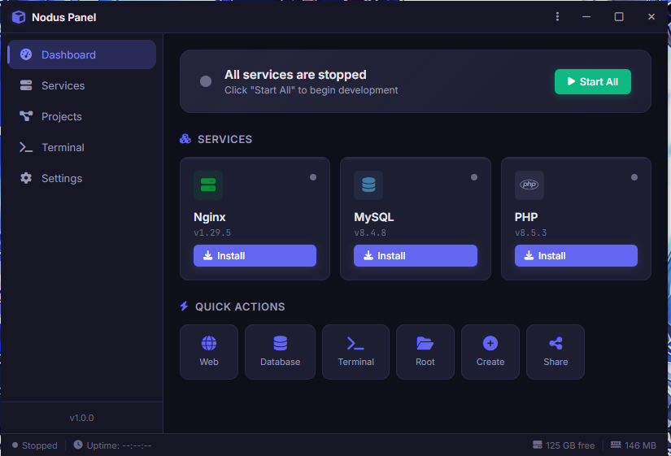

# 🚀 Nodus Panel



Selamat datang di **Nodus Panel**! Ini adalah *local development stack* yang ringan banget, khusus buat kamu pengguna Windows yang pengen server lokal yang nggak ribet, modern, dan powerful.

Bayangkan XAMPP atau Laragon, tapi dibalut dengan teknologi modern (Electron + React) dan punya kontrol yang lebih presisi. Nodus Panel siap jadi teman setia kamu buat ngoding PHP, mainan MySQL, atau sekadar *hosting* web statis lewat Nginx.

---

## ✨ Kenapa Nodus Panel?

- **Multi-PHP Version**: Kamu bisa gonta-ganti versi PHP sesuka hati. Project lama pake PHP 7.4? Project baru pake PHP 8.3? Sikat semua!
- **Auto Virtual Host (vHost)**: Capek edit file `hosts` manual? Nodus Panel bakal otomatis bikinin domain lokal (misal: `project-kamu.test`) buat kamu.
- **Ringan & Portabel**: Nggak perlu instalasi yang ribet. Cukup jalankan, dan semua layanan (Nginx, MySQL, PHP) langsung siap tempur.
- **UI Modern**: Dibangun pake React + Vite, tampilannya cakep dan informatif.

---

## 📂 Struktur Project (Peek into the engine)

Biar nggak bingung, ini dia isi jeroan Nodus Panel:

- **`bin/`**: Tempat ngumpulnya para "pekerja keras" (binary Nginx, MySQL, dan PHP).
- **`www/`**: Playground kamu! Taruh semua folder project web kamu di sini.
- **`data/`**: Memory bank. Di sini semua konfigurasi, log, dan data database MySQL kamu disimpan.
- **`src/`**: Jantung aplikasi (Frontend & Backend logic).
- **`usr/`**: Folder buat kustomisasi kamu sendiri.
- **`nodus-config.json`**: Remote control utama buat setting aplikasi.

---

## 🛠️ Cara Instalasi (Buat Developer)

Kalau kamu pengen ngulik atau jalanin dari source code, ikuti langkah ini:

1. **Clone Repo**
   ```bash
   git clone https://github.com/miuprix/nodus-panel.git
   cd nodus-panel
   ```

2. **Instal Dependensi**
   ```bash
   npm install
   ```

3. **Jalankan Mode Dev** (Vite + Electron)
   ```bash
   npm run dev:electron
   ```

4. **Build ke Executable (.exe)**
   Kalau mau bikin file instalasi sendiri:
   ```bash
   npm run build:exe
   ```

---

## 🚦 Cara Pakai

1. Buka Nodus Panel.
2. Klik tombol **Start** di layanan yang kamu butuhkan (Nginx, MySQL, atau PHP).
3. Masukkan project kamu ke dalam folder `www/`.
4. Akses lewat browser! (Default: `localhost` atau domain vhost yang kamu buat).

---

## 📢 Kontribusi

Punya ide fitur keren atau nemu bug yang nyebelin? Langsung aja buka *Issue* atau kirim *Pull Request*. Kita bangun Nodus Panel bareng-bareng!

---

**Made with ❤️ by [Adi Miuprix](https://github.com/miuprix)**
Copyleft 2026. Happy Coding! 🚀
